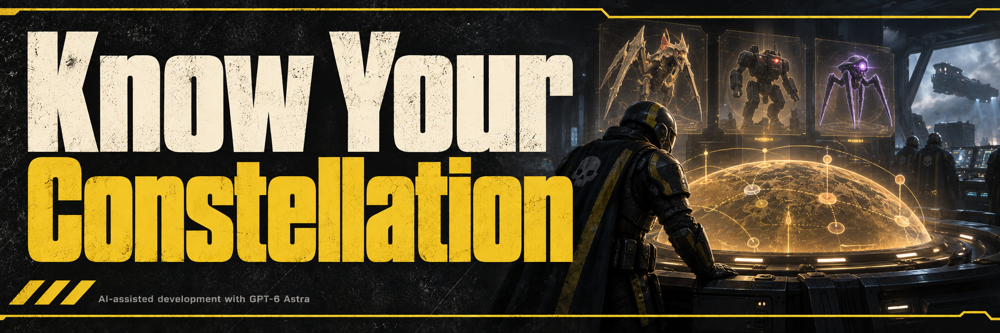

The UI repair updates the screen stack, screen IDs, panel registries and briefing panel offset. Live read-only checks resolve the highlighted mission and forecast panel on the map and briefing. The forecast intentionally hides while choosing loadout equipment. Rendering the installed repair still needs in-game confirmation.

# Know Your Constellation

Reveals mission constellations and enemy forecasts on the war table and briefing screen so you can choose your loadout before deployment.

- Vanilla does not show the mission's enemy constellation before deployment. This mod adds a scrolling forecast to mission previews and the briefing screen.
- Shows constellation names and their associated units for Terminids, Automatons and Illuminate.
- Supports your own operation missions and other players' joinable missions, with the forecast attached to the left panel.
- Uses the game's body font and matching frame style. The briefing forecast stays hidden during pod entry and on the loadout screen.
- Runs only on your client. Other players need their own copy to see it, and enemy spawns and gameplay remain unchanged.
- Forecasts describe the mission's composition and eligible enemies. Individual spawns are not guaranteed.
- The optional [Rows version](docs/ROWS.md) shows the same forecast in static rows so every section is visible at once. Choose one version from the [v3.12 release](https://github.com/CowboyBingus/KnowYourConstellation/releases/tag/v3.12).

Current version: **v3.15**, for game build **25327279**. See [changes](CHANGELOG.md) and [validation coverage](docs/MIGRATION_VALIDATION.md).
