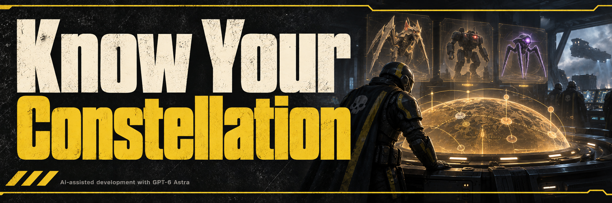

> **v4.1** for Steam build 25480438 / EXE 1.8.46015.0. Offline checks passed; checked in live play.

# Know Your Constellation

Shows every enemy a mission can spawn before you deploy, named as on the Helldivers wiki and weighted by how often they spawn, on the war table and the briefing screen.

- Lists the exact units the mission's constellation, subfaction and difficulty allow, read from the game's own spawn tables. For example, an Incineration Corps mission shows Pyro Troopers and Conflagration Devastators, and Artillery or Assault missions at Extreme and above show War Striders instead of tanks.
- Large enemies get a spawn-rate meter styled after the armory stat bars, so a mission full of War Striders reads differently from one with a few. Smaller enemies are listed most common first.
- Uses the in-game subfaction names: Jet Brigade, Incineration Corps, Cyborg Legion, Predator Strain, Spore Burst Strain, Rupture Strain, Appropriators, Mindless Masses, Vote Snatchers and Invasion Fleet.
- The forecast hangs below the planet panel on the war table and below the mission panel on the briefing screen, leaving the planet information untouched. While a mission is highlighted it may cover the squad list so every enemy stays readable at full size.
- Covers your own operation missions and other players' joinable missions. Hidden during pod entry and on the loadout screen.
- Runs only on your client. Other players need their own copy; spawns and gameplay are unchanged.
- Spawns are not guaranteed. Enemies from map features (Stalker lairs, Shrieker nests, Gunship facilities) and objective-specific targets are not forecast. See [how the forecast is built](docs/CONSTELLATIONS.md).
- Translatable: every text, including enemy and constellation names, follows the game's Text Language when a translation is installed, in any script. Chinese and Japanese wrap between characters. [How to translate](TRANSLATING.md).

**Install:** close the game, import `Know-Your-Constellation-v4.1.zip` and `Bingus-Shared-Loader-v18.zip` into Arsenal or HD2MM, enable both and Purge / Deploy. With Arsenal's default priority, put the loader last. v4.0 replaces both earlier layouts: disable the old Know Your Constellation Rows package if you used it. [Bingus Shared Loader](https://github.com/CowboyBingus/BingusSharedLoader/releases/latest) is a separate required download.

**AI disclosure:** Claude Opus 5.5 assisted with research, implementation, tests and documentation.

Current version: **v4.1**, for game build **25480438**. See [changes](CHANGELOG.md) and [validation coverage](docs/MIGRATION_VALIDATION.md).

## License

Zero-Clause BSD (0BSD): use, copy, modify and distribute for any purpose, with no conditions. See `LICENSE`.
